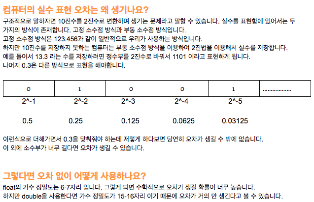

## Chapter 4 *#수*

Mac에서 Int 타입은 64비트 입니다. 그래서 -2^64 ~ 2^64 -1까지 표현이 가능합니다. 맨 앞에 있는 비트는 부호를 나타내는 비트 입니다.  iOS에서는 5s, 아이패드 에어, 아이패드 미니 레티나부터 64비트를 사용하고 그 전 기기들은 모두 32비트를 사용했습니다. 

Int8, Int16, Int32 등 갖가지 Int타입을 설명하는데 필요없고 그냥 Int 쓰면 된다는 결론을 내 맘대로 내렸다.

UInt는 0을 포함한 양의 정수만을 표현한 Int 타입이라고 생각하면 된다. 즉, 음수는 표현이 안된다. (물론 64비트)

부동소수점에서도 대해 다루고 있다. 부동 소수점에 대해 예전에 정리한 글이 있습니다. 

   