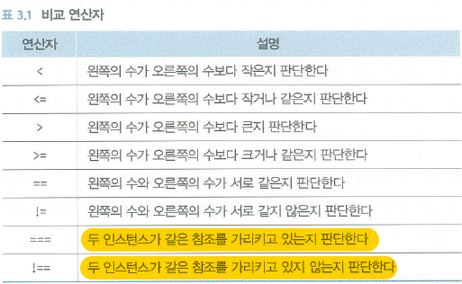
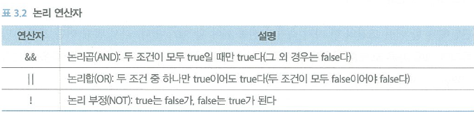

# CHAPTER3 / 조건
<br>
<br>
## 기본 if/else 문
- - -

  

  특이한 점은 `===` 가 타입까지 같은지가 아닌 *같은 참조값* 을 가리키는지 추적한다는 것이다.

  

  기존 타 언어의 논리연산자와 동일하다.

<br>

### CODE

```swift

var age: Int = 26
var message: String

if age <= 26{
  message = "\(age)살은 아직 어립니다."
} else {  
    message = "\(age)살은 어른입니다."
}

print(message)
```
### RESULT

> **26**살은 아직 어립니다.

<br>

## 삼항연산자
- - -
* ``A ? B : C`` 의 형태를 갖으며, ``A가 참이면 B를, 그렇지 않으면 C를 이행하라`` 라고 해석한다.
* *간결한 조건문*을 사용할 시 적합하다.
* 복잡한 조건문은 if/else 문을 사용하는 것이 가독성이 좋다.

<br>

### CODE
```swift
message = age <= 26 ?  "\(age)살은 아직 어립니다." : "\(age)살은 어른입니다."
print(message)
```
결과값은 위와 같다.

<br>

## 이중 if문
- - -
* 경우의 수가 둘 이상일 때는 if문을 중첩해서 사용한다.
* 다수의 조건을 판단할 경우 **switch** 혹은 **else if문**을 사용한다

<br>

### CODE

```swift
var age: Int = 45
var message: String

if age <= 26 {
    message = "\(age)살은 아직 어립니다."
}else  {
    if (age/10) == 4  {
      message = "\(age)살은 40대 입니다."
    }else{
      message = "\(age)살은 40대가 아닙니다."
    }
}

print(message)
```

### RESULT

> **45**살은 40대 입니다.
